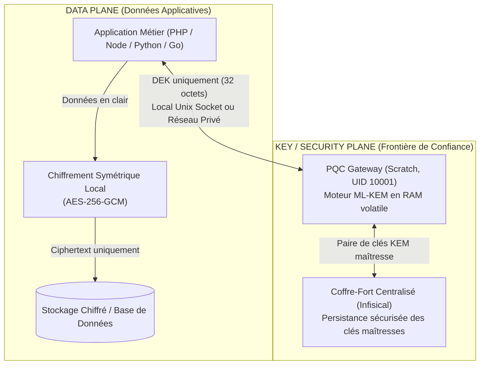
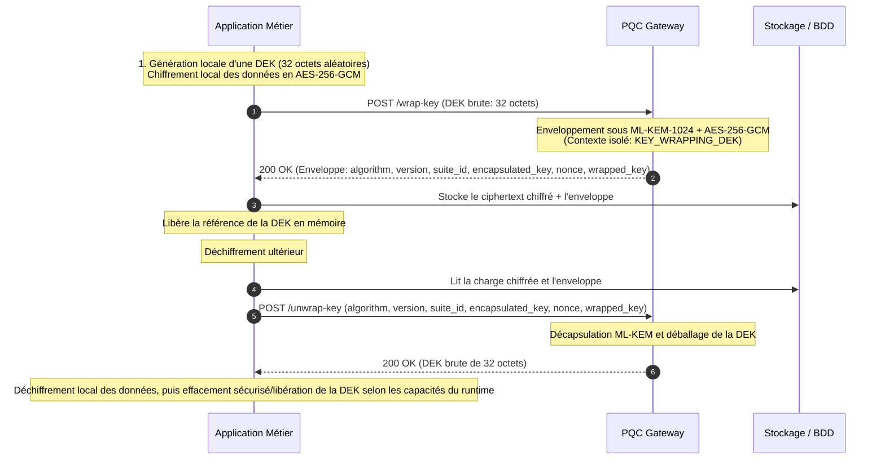

# Passerelle Cryptographique Post-Quantique (ML-KEM + AES-256-GCM)

[🇫🇷 Français](README.fr.md) | [🇬🇧 English](README.md)

Ce projet fournit une passerelle (gateway) autonome de chiffrement et d'encapsulation de clés post-quantique, implémentant l'algorithme **ML-KEM** tel que standardisé dans le **NIST FIPS 203**, et aligné avec les algorithmes retenus par les recommandations **NSA CNSA 2.0**.

> [!IMPORTANT]
> **Positionnement & Frontière de Confiance** :
> Ce composant est conçu exclusivement comme un service d'infrastructure interne destiné à opérer sur un **réseau privé, isolé et segmenté** (ou via socket Unix IPC local). Il n'a **pas vocation à être exposé directement sur Internet** sans couche d'authentification, d'autorisation et de filtrage réseau préalable.

---

## 1. Modèle de Sécurité et Frontières de Confiance (Trust Boundary)

Comprendre le périmètre de sécurité est fondamental avant tout déploiement :



### Principes Clés du Modèle de Menace :
1. **L'accès au Gateway constitue la frontière de confiance** : Tout processus ou conteneur capable de contacter le gateway (via socket Unix ou réseau TCP interne) peut demander l'opération `/unwrap-key`. L'accès au gateway doit donc être réservé exclusivement aux composants applicatifs habilités.
2. **Architecture Sidecar recommandée (1 Gateway par SaaS/App)** : Déployer une instance du gateway dédiée par application ou tenant réduit le rayon d'impact entre consommateurs et empêche l'accès direct aux clés entre applications.
3. **Cas du Gateway partagé (Mutualisation)** : Si une instance unique est partagée entre plusieurs applications, une couche d'authentification réseau stricte (mTLS, segmentation réseau ou jetons) doit être mise en œuvre en amont pour isoler les consommateurs.

---

## 2. Architecture Cryptographique Recommandée : Envelope Encryption (KMS Wrapping)

L'architecture principale recommandée pour protéger des bases de données, des fichiers volumineux et des sauvegardes est l'**Envelope Encryption** via `/wrap-key` et `/unwrap-key`.

### Pourquoi ce modèle est supérieur :
- **Zéro transit de données volumineuses** : Les fichiers de plusieurs mégaoctets ou gigaoctets ne transitent jamais vers le gateway. Seule la clé symétrique de 32 octets est échangée.
- **Performance maximale** : Le chiffrement des gros volumes s'effectue localement dans le processus applicatif (AES-256-GCM avec accélération matérielle AES lorsque disponible).
- **Gestion simplifiée des clés** : Les opérations de gestion de clés concernent principalement les enveloppes DEK compactes plutôt que les volumes de données en vrac. Le versioning et la rotation automatisée des clés maîtresses sont des capacités planifiées.
- **Guide Opérationnel** : Le chiffrement par enveloppe est recommandé pour les données volumineuses ou stockées durablement. Le chiffrement direct demeure un mode pris en charge de premier plan pour les charges utiles réduites et les architectures d'intégration simples.



---

## 3. Modes d'Opération du Gateway

| Endpoint | Rôle | Cas d'Usage | Recommandation |
| :--- | :--- | :--- | :--- |
| **`/wrap-key` & `/unwrap-key`** | **Envelope Encryption (KMS)** | Bases de données, fichiers, sauvegardes, archivage | ⭐ **Architecture Recommandée** |
| `/encrypt` & `/decrypt` | Chiffrement hybride direct | Messages courts (< 10 Mo), payloads JSON | Usage d'appoint |
| `/kem/encapsulate` & `/kem/decapsulate` | Accord de clé pur | Établissement de secret partagé post-quantique | Protocoles personnalisés |
| `/generate-key` | Génération de clé DEK | Génération d'une nouvelle DEK + son enveloppe | Initialisation de session |
| `/public-key` | Distribution de clé KEM | Récupération de la clé publique active | Intégrations asymétriques |
| `/health` | Sonde de vitalité | Healthchecks Docker / orchestrateurs | Supervision |
| `/metrics` | Exposition texte Prometheus | Compteurs de requêtes, histogrammes de latence, rejets de débit | Observabilité *(désactivable via `METRICS_ENABLED`)* |

---

## 4. Spécifications Cryptographiques et Alignements

| Algorithme | Standard de Référence | Clé Publique | Clé Privée (RAM) | Clé Encapsulée | Objectif de Sécurité |
| :--- | :--- | :--- | :--- | :--- | :--- |
| **ML-KEM-1024** *(défaut)* | NIST FIPS 203 | **1568 octets** | 3168 octets | **1568 octets** | Catégorie 5 NIST (Aligné recommandations CNSA 2.0) |
| **ML-KEM-768** | NIST FIPS 203 | 1184 octets | 2400 octets | 1088 octets | Catégorie 3 NIST |
| **DUAL-X25519+ML-KEM-1024** | Hybride classique + PQ | 1600 octets | 3200 octets | 1600 octets | Stratégie de défense en profondeur hybride / migration |
| **DUAL-X25519+ML-KEM-768** | Hybride classique + PQ | 1216 octets | 2432 octets | 1120 octets | Défense en profondeur hybride (Performance / Sécurité) |

- **Alignement CNSA 2.0** : Le service utilise des algorithmes sélectionnés et alignés avec les recommandations CNSA 2.0 pour l'établissement de clés (ML-KEM-1024) et le chiffrement symétrique (AES-256-GCM). *Note : une conformité CNSA 2.0 globale englobe d'autres protocoles et algorithmes (signature ML-DSA) non couverts par cette brique.*
- **Implémentation FIPS 203** : Le gateway implémente ML-KEM conformément aux spécifications du standard NIST FIPS 203 via la bibliothèque CIRCL (Cloudflare). *Il ne prétend pas faire l'objet d'une validation de module FIPS 140-3 / CMVP.*
- **Constructions Hybrides DUAL** : Les modes DUAL (`DUAL-X25519+ML-KEM-768` et `DUAL-X25519+ML-KEM-1024`) sont des constructions hybrides définies par le projet combinant X25519 et ML-KEM via HKDF-SHA256 avec liaison au transcript. Le composant ML-KEM est conforme au standard FIPS 203 ; la construction hybride globale n'est pas en elle-même un standard de KEM du NIST.
- **Gestion des Clés & Mode Éphémère vs Infisical** :
  - Lorsque Infisical est activé, la paire de clés active est chargée depuis le coffre ou stockée sous forme d'un bundle unique vérifié (`PQ_KEM_KEYPAIR`).
  - Lorsqu'il est désactivé, la passerelle fonctionne avec une paire éphémère en mémoire vive.
  - **Avertissement mode éphémère** : lorsque Infisical est désactivé, une nouvelle paire de clés KEM est générée à chaque démarrage du processus. Les ciphertexts et clés enveloppées générés avec une instance précédente ne peuvent être récupérés après un redémarrage, à moins que la paire de clés correspondante n'ait été conservée de manière externe.
- **Cycle de vie et rotation des clés planifiés (Planned Key Lifecycle & Rotation)** :
  - Le support d'identifiants et de versions multiples de clés (`key_id`, `key_version`) pour conserver et sélectionner d'anciennes clés privées lors du déballage d'enveloppes historiques est une évolution planifiée de la feuille de route.
  - Actuellement, le gateway exploite la paire de clés active en mémoire vive synchronisée avec le coffre-fort Infisical.
- **Dérivation HKDF** : HKDF-SHA256 avec transcript canonique TLV (Tag-Length-Value) garantissant l'orthogonalité stricte entre les contextes d'usage.

---

## 5. Modes de Transport : Socket Unix vs Réseau Privé TCP

| Mode | Paramètres | Propriétés de Sécurité | Recommandation |
| :--- | :--- | :--- | :--- |
| **Socket IPC Unix (Mode TCP désactivé)** | `SOCKET_PATH=/tmp/pq-crypto/pq.sock`<br>`DISABLE_TCP=true` | **IPC local géré par le noyau Linux via un Unix Domain Socket dont le point d'entrée réside sur un volume tmpfs éphémère**. Élimine l'exposition au transport réseau sur l'hôte. | ⭐ **Recommandé pour déploiements colocalisés (Sidecar)** |
| **Mode Dual (TCP + Socket)** | `PORT=8080`<br>`SOCKET_PATH=/tmp/pq-crypto/pq.sock`<br>`DISABLE_TCP=false` | Permet une écoute concurrente locale et réseau privé. | Migration ou clients mixtes |
| **Réseau TCP Privé** | `PORT=8080`<br>`SOCKET_PATH=""` | Destiné aux **architectures distribuées sur réseau privé segmenté** (VPC, overlay réseau sécurisé). Pas d'exposition publique. | Déploiements multi-serveurs |

---

## 6. Durcissement du Conteneur et Réduction de la Surface d'Attaque

Le microservice applique les principes du moindre privilège et de réduction de la surface d'attaque de l'hôte :

- **Image `FROM scratch`** : Binaire statique autonome Go (~11 Mo), sans distribution Linux, sans shell (`/bin/sh`), sans utilitaires système (`curl`, `wget`).
- **Utilisateur Non-Root (`UID 10001`)** : Exécution sous un compte dédié restreint `pqcrypto`.
- **Zéro Capacité Noyau (`cap_drop: [ALL]`)** : Toutes les capacités Linux privilégiées sont supprimées à l'instanciation.
- **Système de fichiers en lecture seule (`read_only: true`)** : La racine est verrouillée en écriture. Seul un volume volatile en RAM pure (`tmpfs`) est alloué pour le dossier temporaire et le point d'entrée du socket IPC.
- **Interdiction d'élévation (`no-new-privileges: true`)** : Bloque toute possibilité d'acquisition de droits supplémentaires via des exécutables SUID.
- **Anti-Dump mémoire** : Blocage des appels `ptrace` et des core dumps mémoire via `PR_SET_DUMPABLE=0` sur Linux.
- **Isolation du Daemon Docker (`/var/run/docker.sock`)** : Le conteneur ne monte aucun composant de l'hôte, ne possède aucun droit d'accès au socket Docker du serveur hôte, et est strictement confiné dans son namespace.

---

## 7. Exemples d'Intégration Client (Envelope KMS Recommandée)

### PHP (Envelope Encryption via Socket Unix)
```php
<?php
// 1. Chiffrement local du document volumineux dans l'application
$dek = random_bytes(32); // Clé locale 256 bits
$iv = random_bytes(12);
$tag = '';
$ciphertext = openssl_encrypt($documentData, 'aes-256-gcm', $dek, OPENSSL_RAW_DATA, $iv, $tag);

// 2. Le Gateway enveloppe UNIQUEMENT la clé DEK de 32 octets via le socket IPC
$ch = curl_init('http://localhost/wrap-key');
curl_setopt_array($ch, [
    CURLOPT_UNIX_SOCKET_PATH => '/tmp/pq-crypto/pq.sock',
    CURLOPT_POST           => true,
    CURLOPT_RETURNTRANSFER => true,
    CURLOPT_HTTPHEADER     => ['Content-Type: application/json'],
    CURLOPT_POSTFIELDS     => json_encode(['plaintext_key' => base64_encode($dek)])
]);
$envelope = json_decode(curl_exec($ch), true);
curl_close($ch);
unset($dek); // Libère la référence de la DEK ; PHP ne garantit pas l'effacement physique en mémoire

// 3. Déballage ultérieur de la clé pour lecture
$ch = curl_init('http://localhost/unwrap-key');
curl_setopt_array($ch, [
    CURLOPT_UNIX_SOCKET_PATH => '/tmp/pq-crypto/pq.sock',
    CURLOPT_POST           => true,
    CURLOPT_RETURNTRANSFER => true,
    CURLOPT_HTTPHEADER     => ['Content-Type: application/json'],
    CURLOPT_POSTFIELDS     => json_encode([
        'algorithm'        => $envelope['algorithm'],
        'version'          => $envelope['version'],
        'suite_id'         => $envelope['suite_id'],
        'encapsulated_key' => $envelope['encapsulated_key'],
        'nonce'            => $envelope['nonce'],
        'wrapped_key'      => $envelope['wrapped_key']
    ])
]);
$unwrapped = json_decode(curl_exec($ch), true);
curl_close($ch);

$restoredDek = base64_decode($unwrapped['plaintext_key']);
$originalData = openssl_decrypt($ciphertext, 'aes-256-gcm', $restoredDek, OPENSSL_RAW_DATA, $iv, $tag);
```

### PHP (Avec le client de production)
Implémentation complète disponible dans [`examples/php/client.php`](examples/php/client.php) :
```php
require_once __DIR__ . '/examples/php/client.php';

$pq = new PQCryptoClient('http://127.0.0.1:8080');

// 1. Enveloppe la clé DEK locale AES-256-GCM avec ML-KEM
$envelope = $pq->wrapKey($dek);

// 2. Déchiffre la DEK lors d'une demande ultérieure
$restoredDek = $pq->unwrapKey($envelope);
```

### Node.js (Avec le client de production)
Implémentation complète disponible dans [`examples/node/client.js`](examples/node/client.js) :
```javascript
import { PQCryptoClient } from './examples/node/client.js';

const pq = new PQCryptoClient({ baseURL: 'http://127.0.0.1:8080' });

// 1. Enveloppe la clé symétrique DEK (32 octets) avec ML-KEM
const envelope = await pq.wrapKey(dek);

// 2. Déchiffre l'enveloppe de clé lorsque nécessaire
const restoredDek = await pq.unwrapKey(envelope);
```

---

## 8. Variables d'Environnement Docker Compose

Le fichier `.env` permet d'ajuster le comportement du conteneur :

| Variable | Défaut | Description |
| :--- | :--- | :--- |
| `ALGORITHM` | `ML-KEM-1024` | Suite : `ML-KEM-1024`, `ML-KEM-768`, `DUAL-X25519+ML-KEM-1024`, `DUAL-X25519+ML-KEM-768`. |
| `ENVIRONMENT` | `production` | Environnement : `production`, `staging`, `development`, `test`. |
| `MOCK_MODE` | `false` | Mode simulation pour tests CI sans CPU. **Interdit en production**. |
| `HOST_BIND_ADDRESS` | `127.0.0.1` | Adresse IP hôte à laquelle Docker lie les ports publiés (loopback par défaut). |
| `HOST_PORT` | `8085` | Port publié sur la machine hôte. |
| `LISTEN_ADDRESS` | `0.0.0.0` | Adresse d'interface réseau interne au processus conteneur. |
| `PORT` / `CONTAINER_PORT` | `8080` | Port d'écoute HTTP interne du conteneur. |
| `ACCESS_LOG` | `false` | Journalisation de chaque requête HTTP (désactivé par défaut pour débit maximal). |
| `RATE_LIMIT_RPS` | `0` | Limite de requêtes par seconde (0 = désactivé). |
| `RATE_LIMIT_BURST` | `100` | Capacité en rafale (burst) du limiteur de débit. |
| `LOG_FORMAT` | `json` | Format de journalisation structurée : `json` (recommandé en production) ou `text`. |
| `LOG_LEVEL` | `info` | Niveau de verbosité : `debug`, `info`, `warn`, `error`. |
| `METRICS_ENABLED` | `true` | Expose `/metrics` au format texte Prometheus. À restreindre au réseau de supervision : l'endpoint n'est pas authentifié. |
| `SOCKET_PATH` | *(vide)* | Chemin du socket IPC Unix local (ex: `/tmp/pq-crypto/pq.sock`). |
| `SOCKET_MODE` | `0660` | Permissions de fichier Unix pour le socket IPC. |
| `SOCKET_GID` | `-1` | GID pour le socket Unix IPC (échec fatal en démarrage si non applicable). |
| `DISABLE_TCP` | `false` | `true` désactive le port réseau TCP (mode IPC socket exclusif). |
| `TRUST_PROXY` | `false` | Ne fait confiance à `X-Forwarded-For` que si explicitement activé derrière un proxy fiable. |
| `ALLOW_LEGACY_ENVELOPES` | `false` | Rejette les enveloppes sans version si `false`. |
| `MAX_PAYLOAD_BYTES` | `10485760` (10 Mo)| Taille maximale acceptée pour le corps des requêtes. |
| `READ_TIMEOUT_SECONDS` | `10` | Timeout de lecture HTTP (protection anti-Slowloris). |
| `WRITE_TIMEOUT_SECONDS`| `10` | Timeout d'écriture HTTP. |
| `IDLE_TIMEOUT_SECONDS` | `60` | Timeout d'inactivité HTTP keep-alive. |
| `INFISICAL_ENABLED` | `false` | Active la synchronisation des paires de clés avec Infisical. |
| `INFISICAL_URL` | `http://infisical:8080` | URL d'accès à l'instance Infisical. |
| `INFISICAL_SECRET_BUNDLE_NAME` | `PQ_KEM_KEYPAIR` | Nom du secret pour le bundle atomique de clés. |
| `NO_NEW_PRIVILEGES` | `true` | Interdiction d'élévation de privilèges Linux via SUID. |
| `READ_ONLY_ROOTFS` | `true` | Montage en lecture seule du système de fichiers conteneur. |
| `TMPFS_MOUNT` | `/tmp:rw,noexec,nosuid,nodev,size=16m` | Système de fichiers temporaire en RAM. |
| `HEALTHCHECK_INTERVAL` | `10s` | Fréquence de la sonde `/usr/local/bin/pq-server -healthcheck`. |
| `CPU_LIMIT` / `MEM_LIMIT` | `1.5` / `256M` | Plafonds de ressources système allouées. |

---

## 8b. Observabilité

**Journalisation structurée.** Toute la sortie du service passe par `log/slog`. Au format `json` par défaut,
chaque enregistrement est un objet JSON unique : l'identifiant de corrélation devient un champ indexable
plutôt qu'une sous-chaîne à parser :

```json
{"time":"2026-09-10T19:46:51Z","level":"INFO","msg":"http_request","correlation_id":"a5ce690a63f5...",
 "method":"POST","path":"/wrap-key","status":200,"duration_us":412,"bytes":2104,"remote_addr":"10.0.0.7:52344"}
```

Chaque requête porte un en-tête `X-Correlation-ID`, repris de l'en-tête entrant `X-Correlation-ID` ou
`X-Request-ID` s'il est présent, généré sinon. Il est propagé à la réponse, au journal d'accès et aux
enregistrements de panique, y compris sur les réponses `429` et `500`.

**Métriques.** `/metrics` sert l'exposition texte Prometheus, sans aucune dépendance tierce :

| Série | Type | Étiquettes |
| :--- | :--- | :--- |
| `pqc_requests_total` | compteur | `path`, `status` |
| `pqc_request_duration_seconds` | histogramme | `path` |
| `pqc_rate_limited_total` | compteur | — |
| `pqc_panics_recovered_total` | compteur | — |
| `pqc_uptime_seconds` | jauge | — |
| `pqc_build_info` | jauge | `version`, `algorithm` |

Les bornes de l'histogramme démarrent à 500 µs : une opération KEM+DEM nominale s'exécute largement sous la
milliseconde, des bornes plus grossières écraseraient tout le profil de latence sur une seule barre.

**Cardinalité bornée.** L'étiquette `path` ne porte jamais que des routes déclarées par le routeur. Tout
autre chemin de requête — sondes et scanners compris — est agrégé sous `path="other"`. La table des séries
est construite une fois au démarrage et ne croît jamais en service : la taille et le coût d'un scrape sont
indépendants du trafic reçu, et un appelant ne peut pas transformer l'endpoint d'exposition en amplificateur
mémoire. Le chemin d'instrumentation lui-même n'alloue rien (table de routes immuable, compteurs atomiques).

---

## 9. Assurance Qualité, Tests et Feuille de Route

Le projet intègre une suite de tests rigoureuse et une feuille de route d'assurance qualité :
- **Validation Primitive ML-KEM (KAT NIST ACVP)** : L'implémentation CIRCL ML-KEM exploitée par le gateway est confrontée aux 180 cas du corpus NIST ACVP FIPS 203 épinglé (75 KeyGen, 75 Encap, 30 Decap), avec correspondance stricte octet par octet. Les couches protocolaires HTTP et d'intégration font l'objet de tests de régression et d'invariants de sécurité dédiés.
- **Stress-Test Séquentiel Chaîné** : 2 000 cycles consécutifs déterministes de génération de clés, encapsulation et décapsulation conçus pour détecter toute dérive d'état, rupture de reproductibilité ou régression d'intégration.
- **Vecteurs de Régression Déterministes** : Tests reproductibles couvrant les transcripts canoniques, la dérivation HKDF, les enveloppes binaires et l'isolation des domaines cryptographiques.
- **Invariants de Sécurité & Tests aux Limites** : Contrôle du rejet systématique des enveloppes falsifiées, des suites incompatibles et de la séparation stricte des domaines HKDF.
- **Détection des Conditions de Course** : Vérification systématique avec `go test -race` (disponible via `make test-race` et automatisée dans la CI).
- **Audit des Vulnérabilités de Dépendances** : Analyse automatisée des dépendances via `govulncheck` (disponible via `make vulncheck` et automatisée dans la CI). Le service ne porte **aucune dépendance cryptographique tierce directe** : la dérivation de clé s'appuie sur `crypto/hkdf` de la bibliothèque standard (Go 1.24+), situé dans le périmètre du module FIPS 140-3 de Go. La seule dépendance directe effectuant de la cryptographie est CIRCL, pour ML-KEM.
- **Audit de l'Artefact Livré** : La CI construit l'image conteneur, teste le conteneur en fonctionnement (`/health`, `/metrics`, en-tête de corrélation), extrait le binaire effectivement livré et le scanne via `govulncheck -mode=binary`. Le Dockerfile compile avec son propre toolchain épinglé, distinct de celui des autres jobs : seul un scan de l'artefact extrait couvre cet écart.
- **Intégration Continue (CI)** : Workflow GitHub Actions exécuté à chaque push et pull request (quatre jobs : lint, tests, audit de dépendances, audit d'image).
- **Feuille de route qualité** :
  - Versioning et cycle de rotation automatisé des clés maîtresses.
  - Fuzzing continu des parseurs d'enveloppes binaires.
  - Intégration de scans de vulnérabilités d'image conteneur (Trivy) et génération de SBOM (Software Bill of Materials).
  - Enrichissement des métriques : compteurs par suite et par version d'enveloppe, alignés sur le cycle de rotation des clés.

### Preuve d'Exécution & Résultats des Tests (`go test -v`)

```text
=== RUN   TestKAT_NIST_FIPS203_KeyGen
    ✅ NIST FIPS 203 KeyGen [ML-KEM-512]:  25/25 vecteurs validés au bit près
    ✅ NIST FIPS 203 KeyGen [ML-KEM-768]:  25/25 vecteurs validés au bit près
    ✅ NIST FIPS 203 KeyGen [ML-KEM-1024]: 25/25 vecteurs validés au bit près
    Total KeyGen NIST FIPS 203 : 75/75 validés
--- PASS: TestKAT_NIST_FIPS203_KeyGen

=== RUN   TestKAT_NIST_FIPS203_EncapDecap
    ✅ NIST FIPS 203 Encap AFT [ML-KEM-512]:  25/25 vecteurs validés
    ✅ NIST FIPS 203 Encap AFT [ML-KEM-768]:  25/25 vecteurs validés
    ✅ NIST FIPS 203 Encap AFT [ML-KEM-1024]: 25/25 vecteurs validés
    ✅ NIST FIPS 203 Decap VAL [ML-KEM-512]:  10/10 vecteurs validés
    ✅ NIST FIPS 203 Decap VAL [ML-KEM-768]:  10/10 vecteurs validés
    ✅ NIST FIPS 203 Decap VAL [ML-KEM-1024]: 10/10 vecteurs validés
    Total Encap/Decap NIST FIPS 203 : 105/105 validés
--- PASS: TestKAT_NIST_FIPS203_EncapDecap

=== RUN   TestKAT_NIST_FIPS203_MonteCarlo_StressTest
    ✅ Monte-Carlo [ML-KEM-768]:  1 000 itérations séquentielles validées (Accumulateur: b27f9cc4...)
    ✅ Monte-Carlo [ML-KEM-1024]: 1 000 itérations séquentielles validées (Accumulateur: 2b13db7c...)
--- PASS: TestKAT_NIST_FIPS203_MonteCarlo_StressTest

PASS (Ensemble des suites unitaires, de régression, d'invariants et de KAT validées)
```

---

## 10. Avertissement & Non-Certification (Disclaimer)

> [!CAUTION]
> **Statut du Projet & Absence de Certification Formelle** :
> - Ce projet est une implémentation logicielle à code source public destinée à explorer et intégrer la cryptographie post-quantique dans des architectures privées.
> - **Ce logiciel n'a pas fait l'objet d'un audit de sécurité indépendant par un laboratoire accrédité.**
> - **Ce composant n'est pas certifié FIPS 140-3 et n'est pas validé par le programme CMVP (Cryptographic Module Validation Program).**
> - L'emploi de termes comme "FIPS 203" ou "CNSA 2.0" fait référence aux **algorithmes mathématiques sous-jacents** et non à une labellisation officielle ou d'État.
> - Pour tout usage en environnement critique, il appartient à l'intégrateur de réaliser une analyse de risques rigoureuse et de confiner ce service selon les règles de l'art.

---

## 11. Licence

Distribué sous [Business Source License 1.1](LICENSE) (SPDX : `BUSL-1.1`) — Copyright (c) 2026 fdecourt.

Le code source est public, mais il ne s'agit **pas** d'une licence open source. En résumé :

| Usage | Autorisé |
|-------|----------|
| Lire, auditer, copier, modifier, redistribuer, usage hors production | Oui |
| Usage en production pour les **besoins internes** de votre organisation | Oui (Additional Use Grant) |
| Proposer la passerelle, ou un service qui l'expose, à des tiers (hébergé, managé, embarqué, marque blanche) | Non — licence commerciale requise |
| Vendre, sous-licencier ou distribuer contre rémunération | Non — licence commerciale requise |

À la **Change Date (2030-09-11)**, cette version passe automatiquement sous **licence Apache 2.0**. Seul le fichier [LICENSE](LICENSE) fait foi ; ce tableau n'en est qu'un résumé. Pour une licence commerciale, contactez le concédant via [github.com/fdecourt](https://github.com/fdecourt).

La licence est indépendante de l'avertissement ci-dessus : l'absence de certification formelle reste valable quoi que la licence permette.

### Third-Party Licenses

Les composants livrés avec le service conservent leur propre licence. Leurs textes complets et mentions obligatoires figurent dans [THIRD_PARTY_LICENSES](THIRD_PARTY_LICENSES), également embarqué dans l'image conteneur sous `/THIRD_PARTY_LICENSES`.

| Composant | Licence | Livré sous forme |
|-----------|---------|------------------|
| Bibliothèque standard & runtime Go | BSD-3-Clause | compilé dans `pq-server` |
| `golang.org/x/sys` | BSD-3-Clause | compilé dans `pq-server` |
| `golang.org/x/time` | BSD-3-Clause | compilé dans `pq-server` |
| `github.com/cloudflare/circl` (ML-KEM) | BSD-3-Clause | compilé dans `pq-server` |
| Magasin de certificats CA Mozilla (paquet Alpine `ca-certificates-bundle`) | MPL-2.0 AND MIT | `/etc/ssl/certs/ca-certificates.crt` dans l'image |
