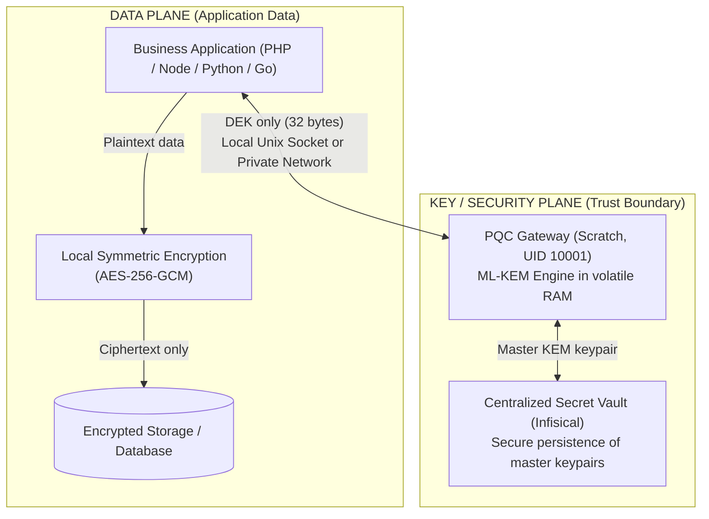
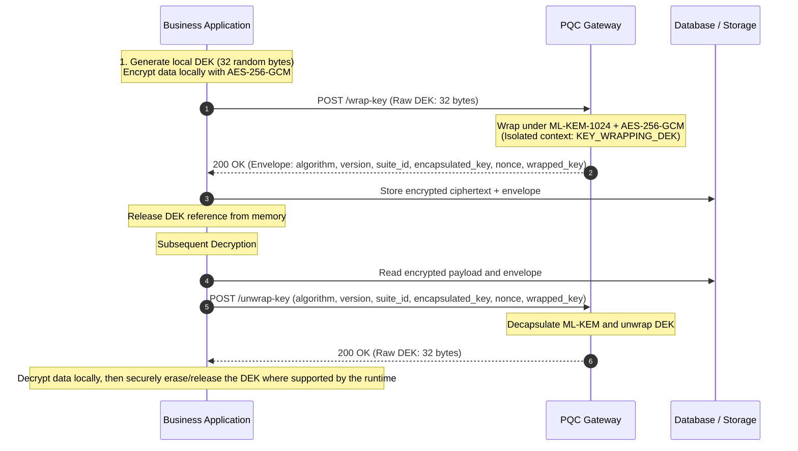

# Post-Quantum Cryptography Gateway (ML-KEM + AES-256-GCM)

[🇬🇧 English](README.md) | [🇫🇷 Français](README.fr.md)

This project provides an autonomous post-quantum encryption and key encapsulation gateway, implementing **ML-KEM** as standardized in **NIST FIPS 203**, and using algorithms aligned with **NSA CNSA 2.0** recommendations.

> [!IMPORTANT]
> **Deployment Context & Trust Boundary**:
> This component is designed exclusively as an internal infrastructure service operating on a **private, isolated, and segmented network** (or via local Unix IPC socket). It is **not intended for direct public exposure to the Internet** without a preceding authentication, authorization, and network filtering layer.

---

## 1. Security Model and Trust Boundary

Understanding the security perimeter is essential prior to deployment:



### Key Threat Model Principles:
1. **Gateway access is a trust boundary**: Any client or container able to communicate with the gateway (via Unix socket or internal TCP network) can issue `/unwrap-key` operations. Consequently, network and socket access must be strictly restricted to authorized services.
2. **Recommended Sidecar Pattern (1 Gateway per Application / SaaS)**: Deploying a dedicated gateway instance per application or tenant reduces cross-consumer blast radius and prevents direct cross-application key access.
3. **Shared Gateway Pattern (Multi-Tenancy)**: If a single gateway instance is shared across multiple applications, an upstream authentication layer (mTLS, network policy segmentation, or application tokens) must be implemented to isolate consumers.

---

## 2. Recommended Architecture: Envelope Encryption (KMS Wrapping)

The primary recommended design pattern for databases, large files, and backups is **Envelope Encryption** using `/wrap-key` and `/unwrap-key`.

### Why this architecture is preferred:
- **Zero large data transmission**: Files of several megabytes or gigabytes never travel to the gateway. Only the 32-byte Data Encryption Key (DEK) is transmitted.
- **Optimal throughput**: Bulk encryption occurs locally in application memory using native AES-256-GCM (leveraging hardware AES acceleration when available).
- **Streamlined key management**: Key-management operations primarily concern compact wrapped DEK envelopes rather than bulk encrypted datasets. Automated master-key versioning and rotation are planned capabilities.
- **Operational Guidance**: Envelope encryption is recommended for large or persistently stored data. Direct encryption remains a supported first-class mode for small payloads and simpler integration patterns.



---

## 3. Gateway Endpoints Overview

| Endpoint | Role | Use Case | Recommendation |
| :--- | :--- | :--- | :--- |
| **`/wrap-key` & `/unwrap-key`** | **Envelope Encryption (KMS)** | Databases, files, backups, long-term archives | ⭐ **Recommended Architecture** |
| `/encrypt` & `/decrypt` | Direct hybrid encryption | Small messages (< 10 MB), JSON payloads | Secondary / convenience |
| `/kem/encapsulate` & `/kem/decapsulate` | Pure KEM Key Agreement | Post-quantum shared secret establishment | Custom protocols |
| `/generate-key` | KMS Key Generation | Generates a new DEK + its wrapped envelope | Initial session setup |
| `/public-key` | Public Key Distribution | Retrieves active post-quantum public key | Asymmetric pipelines |
| `/health` | Liveness & Readiness probe | Docker healthchecks & orchestrator probes | Monitoring |
| `/metrics` | Prometheus text exposition | Request counters, latency histograms, rate-limit rejections | Observability *(opt-out via `METRICS_ENABLED`)* |

---

## 4. Cryptographic Specifications and Alignment

| Algorithm | Reference Standard | Public Key | Private Key (RAM) | Ciphertext (EncapKey) | Security Objective |
| :--- | :--- | :--- | :--- | :--- | :--- |
| **ML-KEM-1024** *(default)* | NIST FIPS 203 | **1568 bytes** | 3168 bytes | **1568 bytes** | NIST Category 5 (Aligned with CNSA 2.0 key establishment recommendations) |
| **ML-KEM-768** | NIST FIPS 203 | 1184 bytes | 2400 bytes | 1088 bytes | NIST Category 3 |
| **DUAL-X25519+ML-KEM-1024** | Classical + PQ Hybrid | 1600 bytes | 3200 bytes | 1600 bytes | Hybrid defense-in-depth / migration strategy |
| **DUAL-X25519+ML-KEM-768** | Classical + PQ Hybrid | 1216 bytes | 2432 bytes | 1120 bytes | Hybrid defense-in-depth (Performance / Security) |

- **CNSA 2.0 Alignment**: The service uses algorithms selected and aligned with CNSA 2.0 recommendations for key establishment (ML-KEM-1024) and symmetric payload protection (AES-256-GCM). *Note: Comprehensive CNSA 2.0 compliance covers broader protocol and digital signature standards (ML-DSA) not included in this microservice.*
- **FIPS 203 Implementation**: The gateway implements ML-KEM as standardized in NIST FIPS 203 using Cloudflare's CIRCL library. *It does not claim an official NIST FIPS 140-3 or CMVP cryptographic module validation.*
- **DUAL Hybrid Constructions**: The DUAL modes (`DUAL-X25519+ML-KEM-768` and `DUAL-X25519+ML-KEM-1024`) are project-defined hybrid constructions combining X25519 and ML-KEM through HKDF-SHA256 with transcript binding. The ML-KEM component conforms to FIPS 203; the complete hybrid construction is not itself a NIST-standardized KEM.
- **Key Management & Ephemeral vs Vault Mode**:
  - When Infisical is enabled, the active keypair is loaded from or stored as a single keypair bundle in the vault (`PQ_KEM_KEYPAIR`).
  - When disabled, the gateway operates with an ephemeral in-memory keypair.
  - **Ephemeral Mode Note**: When Infisical is disabled, a new KEM keypair is generated at each process start. Ciphertexts or wrapped keys produced with a previous process instance cannot be recovered after restart unless the corresponding keypair has been externally preserved.
- **Planned Key Lifecycle & Rotation**:
  - Adding multiple key identifiers and version headers (`key_id`, `key_version`) to support retaining historical private keys for unwrapping archived envelopes is a planned roadmap capability.
  - Currently, the gateway operates with the single active keypair held in volatile memory and synchronized with Infisical.
- **HKDF Derivation**: HKDF-SHA256 with canonical TLV (Tag-Length-Value) transcripts enforcing domain separation between use cases.

---

## 5. Transport Protocols: Unix Domain Socket vs Private TCP Network

| Mode | Parameters | Security Properties | Recommended For |
| :--- | :--- | :--- | :--- |
| **Unix IPC Socket (TCP-Disabled Mode)** | `SOCKET_PATH=/tmp/pq-crypto/pq.sock`<br>`DISABLE_TCP=true` | **Local kernel IPC through a Unix Domain Socket whose filesystem entry resides on an ephemeral tmpfs volume**. Eliminates network transport exposure on the host. | ⭐ **Collocated Sidecar deployments** |
| **Dual Mode (TCP + Socket)** | `PORT=8080`<br>`SOCKET_PATH=/tmp/pq-crypto/pq.sock`<br>`DISABLE_TCP=false` | Concurrent local IPC and private network listening. | Progressive migration / hybrid clients |
| **Private TCP Network** | `PORT=8080`<br>`SOCKET_PATH=""` | Intended for **distributed architectures over a secure private network** (VPC, overlay mesh). No public access. | Multi-server deployments |

---

## 6. Container Hardening & Reduced Host Attack Surface

The service enforces strict least-privilege principles to reduce the host attack surface:

- **`FROM scratch` Image**: Autonomous static Go binary (~11 MB), containing no OS distribution, no shell (`/bin/sh`), and no system utilities (`curl`, `wget`).
- **Non-Root User (`UID 10001`)**: Executes under the dedicated unprivileged `pqcrypto` account.
- **Zero Kernel Capabilities (`cap_drop: [ALL]`)**: All elevated Linux capabilities are dropped at container start.
- **Read-Only Root Filesystem (`read_only: true`)**: The root disk is locked against modifications. Ephemeral files and the IPC socket entry point live strictly in an in-memory `tmpfs` volume.
- **No Privilege Escalation (`no-new-privileges: true`)**: Prevents privilege acquisition via SUID executables.
- **Anti-Memory-Dump Hardening**: Core dumps and unauthorized `ptrace` inspection are blocked via `PR_SET_DUMPABLE=0` on Linux.
- **Docker Daemon Isolation (`/var/run/docker.sock`)**: The container does not mount the host Docker socket, possesses no permissions to access it, and operates in an isolated mount namespace.

---

## 7. Client Integration Examples (Envelope KMS Pattern)

### PHP (Envelope Encryption via Unix Socket)
```php
<?php
// 1. Locally encrypt the large document in application memory
$dek = random_bytes(32); // 256-bit local key
$iv = random_bytes(12);
$tag = '';
$ciphertext = openssl_encrypt($documentData, 'aes-256-gcm', $dek, OPENSSL_RAW_DATA, $iv, $tag);

// 2. Gateway wraps ONLY the 32-byte DEK over the local Unix IPC socket
$ch = curl_init('http://localhost/wrap-key');
curl_setopt_array($ch, [
    CURLOPT_UNIX_SOCKET_PATH => '/tmp/pq-crypto/pq.sock',
    CURLOPT_POST           => true,
    CURLOPT_RETURNTRANSFER => true,
    CURLOPT_HTTPHEADER     => ['Content-Type: application/json'],
    CURLOPT_POSTFIELDS     => json_encode(['plaintext_key' => base64_encode($dek)])
]);
$envelope = json_decode(curl_exec($ch), true);
curl_close($ch);
unset($dek); // Release the DEK reference; PHP does not guarantee secure memory zeroization

// 3. Subsequent unwrapping to read the document
$ch = curl_init('http://localhost/unwrap-key');
curl_setopt_array($ch, [
    CURLOPT_UNIX_SOCKET_PATH => '/tmp/pq-crypto/pq.sock',
    CURLOPT_POST           => true,
    CURLOPT_RETURNTRANSFER => true,
    CURLOPT_HTTPHEADER     => ['Content-Type: application/json'],
    CURLOPT_POSTFIELDS     => json_encode([
        'algorithm'        => $envelope['algorithm'],
        'version'          => $envelope['version'],
        'suite_id'         => $envelope['suite_id'],
        'encapsulated_key' => $envelope['encapsulated_key'],
        'nonce'            => $envelope['nonce'],
        'wrapped_key'      => $envelope['wrapped_key']
    ])
]);
$unwrapped = json_decode(curl_exec($ch), true);
curl_close($ch);

$restoredDek = base64_decode($unwrapped['plaintext_key']);
$originalData = openssl_decrypt($ciphertext, 'aes-256-gcm', $restoredDek, OPENSSL_RAW_DATA, $iv, $tag);
```

### PHP (Using the Production Client)
Complete implementation available in [`examples/php/client.php`](examples/php/client.php):
```php
require_once __DIR__ . '/examples/php/client.php';

$pq = new PQCryptoClient('http://127.0.0.1:8080');

// 1. Wrap local AES-256-GCM DEK with post-quantum ML-KEM
$envelope = $pq->wrapKey($dek);

// 2. Restore DEK whenever decryption is requested
$restoredDek = $pq->unwrapKey($envelope);
```

### Node.js (Using the Production Client)
Complete implementation available in [`examples/node/client.js`](examples/node/client.js):
```javascript
import { PQCryptoClient } from './examples/node/client.js';

const pq = new PQCryptoClient({ baseURL: 'http://127.0.0.1:8080' });

// 1. Wrap local 32-byte DEK with post-quantum ML-KEM
const envelope = await pq.wrapKey(dek);

// 2. Restore DEK whenever decryption is needed
const restoredDek = await pq.unwrapKey(envelope);
```

---

## 8. Docker Compose Configuration Variables

The `.env` file provides configuration tuning for the gateway:

| Variable | Default | Description |
| :--- | :--- | :--- |
| `ALGORITHM` | `ML-KEM-1024` | Cryptographic suite: `ML-KEM-1024`, `ML-KEM-768`, `DUAL-X25519+ML-KEM-1024`, `DUAL-X25519+ML-KEM-768`. |
| `ENVIRONMENT` | `production` | Environment mode: `production`, `staging`, `development`, `test`. |
| `MOCK_MODE` | `false` | In-memory mock engine for CPU-light CI tests. **Forbidden in production**. |
| `HOST_BIND_ADDRESS` | `127.0.0.1` | Host IP address Docker binds published ports to (loopback default). |
| `HOST_PORT` | `8085` | Port published on the host. |
| `LISTEN_ADDRESS` | `0.0.0.0` | Internal network interface IP for the container process. |
| `PORT` / `CONTAINER_PORT` | `8080` | Internal container HTTP listening port. |
| `ACCESS_LOG` | `false` | Access logging per HTTP request (disabled by default for maximum throughput). |
| `RATE_LIMIT_RPS` | `0` | Rate limiter queries per second (0 = disabled). |
| `RATE_LIMIT_BURST` | `100` | Rate limiter token bucket burst capacity. |
| `LOG_FORMAT` | `json` | Structured log output: `json` (recommended in production) or `text`. |
| `LOG_LEVEL` | `info` | Log verbosity: `debug`, `info`, `warn`, `error`. |
| `METRICS_ENABLED` | `true` | Exposes `/metrics` in Prometheus text format. Restrict to your monitoring network: the endpoint is unauthenticated. |
| `SOCKET_PATH` | *(empty)* | Local Unix IPC socket path (e.g. `/tmp/pq-crypto/pq.sock`). |
| `SOCKET_MODE` | `0660` | Unix file permissions for the IPC socket. |
| `SOCKET_GID` | `-1` | Group ID for IPC Unix socket (fails closed if set and chown fails). |
| `DISABLE_TCP` | `false` | When `true`, disables TCP network listener entirely (IPC socket only). |
| `TRUST_PROXY` | `false` | Only honor `X-Forwarded-For` when set to `true` behind a trusted reverse proxy. |
| `ALLOW_LEGACY_ENVELOPES` | `false` | Rejects unversioned envelopes if `false`. |
| `MAX_PAYLOAD_BYTES` | `10485760` (10 MB)| Request body size ceiling (protects against DOS). |
| `READ_TIMEOUT_SECONDS` | `10` | HTTP read timeout (mitigates Slowloris attacks). |
| `WRITE_TIMEOUT_SECONDS`| `10` | HTTP write timeout. |
| `IDLE_TIMEOUT_SECONDS` | `60` | HTTP idle keep-alive timeout. |
| `INFISICAL_ENABLED` | `false` | Enables keypair synchronization with an Infisical secret vault. |
| `INFISICAL_URL` | `http://infisical:8080` | URL for the Infisical instance. |
| `INFISICAL_SECRET_BUNDLE_NAME` | `PQ_KEM_KEYPAIR` | Secret name for atomic keypair bundle. |
| `NO_NEW_PRIVILEGES` | `true` | Forbids privilege escalation via Linux SUID binaries. |
| `READ_ONLY_ROOTFS` | `true` | Mounts root container filesystem in read-only mode. |
| `TMPFS_MOUNT` | `/tmp:rw,noexec,nosuid,nodev,size=16m` | Volatile in-memory filesystem for ephemeral files. |
| `HEALTHCHECK_INTERVAL` | `10s` | Frequency for `/usr/local/bin/pq-server -healthcheck`. |
| `CPU_LIMIT` / `MEM_LIMIT` | `1.5` / `256M` | Resource ceiling limits. |

---

## 8b. Observability

**Structured logging.** All service output is emitted through `log/slog`. In the default `json` format each
record is a single JSON object, so the correlation identifier is an indexable field rather than a substring
to parse:

```json
{"time":"2026-09-10T19:46:51Z","level":"INFO","msg":"http_request","correlation_id":"a5ce690a63f5...",
 "method":"POST","path":"/wrap-key","status":200,"duration_us":412,"bytes":2104,"remote_addr":"10.0.0.7:52344"}
```

Every request carries an `X-Correlation-ID` header, honoured from the inbound `X-Correlation-ID` or
`X-Request-ID` when present, generated otherwise. It is propagated to the response, the access log and the
panic records, including on `429` and `500` responses.

**Metrics.** `/metrics` serves the Prometheus text exposition format with no third-party dependency:

| Series | Type | Labels |
| :--- | :--- | :--- |
| `pqc_requests_total` | counter | `path`, `status` |
| `pqc_request_duration_seconds` | histogram | `path` |
| `pqc_rate_limited_total` | counter | — |
| `pqc_panics_recovered_total` | counter | — |
| `pqc_uptime_seconds` | gauge | — |
| `pqc_build_info` | gauge | `version`, `algorithm` |

Histogram buckets start at 500 µs: a nominal KEM+DEM operation completes well below the millisecond, so
coarser buckets would collapse the entire latency profile into a single bar.

**Bounded cardinality.** The `path` label only ever carries a route declared by the router. Any other
request path — including probes and scanners — is aggregated under `path="other"`. The series table is
built once at startup and never grows during service, so the size and cost of a scrape are independent of
the traffic received, and a caller cannot turn the exposition endpoint into a memory amplifier. The
instrumentation path itself performs no allocation (immutable route table, atomic counters).

---

## 9. Quality Assurance, Testing & Roadmap

The codebase undergoes rigorous verification and includes a testing roadmap:
- **ML-KEM Primitive Validation (NIST ACVP KAT)**: The CIRCL ML-KEM implementation used by the gateway is checked against all 180 cases of the pinned NIST ACVP FIPS 203 dataset (75 KeyGen, 75 Encap, 30 Decap), with exact byte matching. Gateway protocol and integration behavior are covered by separate regression and security-invariant tests.
- **Chained Stress Testing**: 2,000 sequential deterministic keygen/encap/decap cycles designed to detect state drift, reproducibility failures, and integration regressions.
- **Deterministic Regression Vectors**: Reproducible tests covering canonical transcripts, HKDF derivation, binary envelopes, and cryptographic domain separation.
- **Security Invariants & Boundary Tests**: Extensive tests verifying binary envelope formats, algorithm falsification rejection, and HKDF domain separation.
- **Race Condition Detection**: Verified with `go test -race` (available via `make test-race` and automated in CI).
- **Dependency Vulnerability Auditing**: Automated dependency vulnerability scanning via `govulncheck` (available via `make vulncheck` and automated in CI). The service carries **no direct third-party cryptographic dependency**: key derivation uses the standard library `crypto/hkdf` (Go 1.24+), which sits inside the Go FIPS 140-3 module boundary. The only direct dependency performing cryptography is CIRCL, for ML-KEM.
- **Shipped Artifact Auditing**: CI builds the container image, smoke-tests the running container (`/health`, `/metrics`, correlation header), extracts the binary that is actually shipped and scans it with `govulncheck -mode=binary`. The Dockerfile compiles with its own pinned toolchain, distinct from the one used by the other jobs: only a scan of the extracted artifact covers that gap.
- **Continuous Integration**: GitHub Actions workflow automated on every push and pull request (four jobs: lint, test, dependency audit, image audit).
- **Roadmap**:
  - Automated master-key versioning and rotation lifecycle.
  - Continuous fuzzing of binary envelope parsers.
  - Container image vulnerability scanning (Trivy) and automated SBOM generation.
  - Metrics enrichment: per-suite and per-envelope-version counters, aligned with the key rotation lifecycle.

### Verification Evidence & Test Execution (`go test -v`)

```text
=== RUN   TestKAT_NIST_FIPS203_KeyGen
    ✅ NIST FIPS 203 KeyGen [ML-KEM-512]:  25/25 vectors PASS (exact bit-match)
    ✅ NIST FIPS 203 KeyGen [ML-KEM-768]:  25/25 vectors PASS (exact bit-match)
    ✅ NIST FIPS 203 KeyGen [ML-KEM-1024]: 25/25 vectors PASS (exact bit-match)
    Total KeyGen NIST FIPS 203 vectors: 75/75 PASS
--- PASS: TestKAT_NIST_FIPS203_KeyGen

=== RUN   TestKAT_NIST_FIPS203_EncapDecap
    ✅ NIST FIPS 203 Encap AFT [ML-KEM-512]:  25/25 vectors PASS
    ✅ NIST FIPS 203 Encap AFT [ML-KEM-768]:  25/25 vectors PASS
    ✅ NIST FIPS 203 Encap AFT [ML-KEM-1024]: 25/25 vectors PASS
    ✅ NIST FIPS 203 Decap VAL [ML-KEM-512]:  10/10 vectors PASS
    ✅ NIST FIPS 203 Decap VAL [ML-KEM-768]:  10/10 vectors PASS
    ✅ NIST FIPS 203 Decap VAL [ML-KEM-1024]: 10/10 vectors PASS
    Total Encap/Decap NIST FIPS 203 vectors: 105/105 PASS
--- PASS: TestKAT_NIST_FIPS203_EncapDecap

=== RUN   TestKAT_NIST_FIPS203_MonteCarlo_StressTest
    ✅ Monte-Carlo [ML-KEM-768]:  1,000 chained cycles PASS (Accumulator: b27f9cc4...)
    ✅ Monte-Carlo [ML-KEM-1024]: 1,000 chained cycles PASS (Accumulator: 2b13db7c...)
--- PASS: TestKAT_NIST_FIPS203_MonteCarlo_StressTest

PASS (All unit, regression, security invariant, and KAT suites passing)
```

---

## 10. Disclaimer & Non-Certification Notice

> [!CAUTION]
> **Project Status & Absence of Formal Certification**:
> - This software is an open-source project designed to explore and integrate post-quantum cryptography within private architectures.
> - **This software has NOT undergone a formal, independent security audit by an accredited third-party testing laboratory.**
> - **This component is NOT certified under NIST FIPS 140-3 and has NOT been validated by the Cryptographic Module Validation Program (CMVP).**
> - References to "FIPS 203" or "CNSA 2.0" denote the **underlying mathematical algorithms** and specifications implemented, not an official government or regulatory certification.
> - For critical production environments, integrators must perform their own threat modeling and risk assessment, and enforce defense-in-depth isolation measures.
